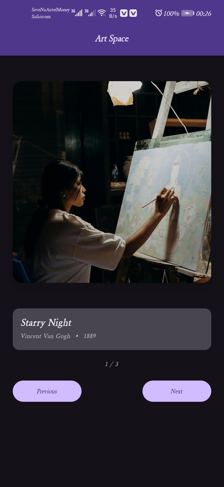

# 🎨 Art Space App

An Android app that displays a curated collection of artworks with smooth
navigation controls. Built with Kotlin and Jetpack Compose as part of the
Google Android Developer course (Unit 3).

---

## 📱 Screenshots



---

## ✨ Features

- Browse through a collection of famous artworks
- View artwork title, artist name, and year
- Navigate with Previous and Next buttons
- Wrap-around navigation (loops back at the end)
- Clean Material Design 3 UI
- Fully built with Jetpack Compose — no XML

---

## 🧠 Concepts Practiced

- `@Composable` functions and Jetpack Compose UI
- State management with `remember` and `mutableIntStateOf`
- Recomposition and unidirectional data flow
- Kotlin `data class` for modeling data
- `Column`, `Row`, `Spacer` layouts
- Material Design 3 theming and components
- Debugging with Logcat

---

## 🛠️ Built With

- [Kotlin](https://kotlinlang.org/)
- [Jetpack Compose](https://developer.android.com/compose)
- [Material Design 3](https://m3.material.io/)
- Android Studio Hedgehog

---

## 🚀 How to Run

1. Clone the repository:
```bash
   git clone https://github.com/Merlin-Kotlin/art-space-app.git  
```

2. Open the project in **Android Studio**
3. Let Gradle sync complete
4. Run on an emulator or physical device (API 24+)

---

## 📚 Course Reference

Built as part of the
[Android Basics with Compose](https://developer.android.com/courses/android-basics-compose/course)
course by Google — Unit 3.

---

## 👨‍💻 Author

Merlin
[GitHub Profile](https://github.com/Merlin-Kotlin/art-space-app.git)

---

## 📄 License

This project is open source and available under the
[MIT License](LICENSE).